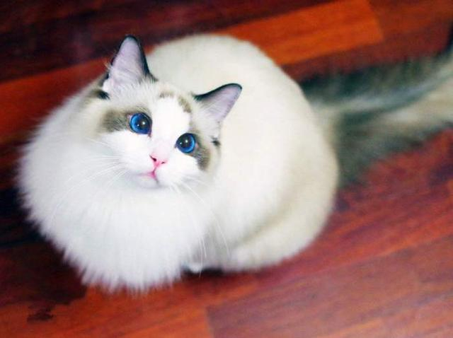
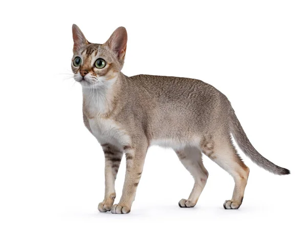
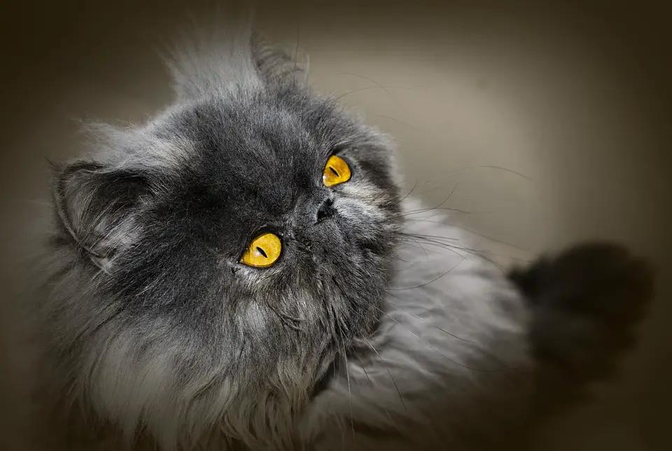
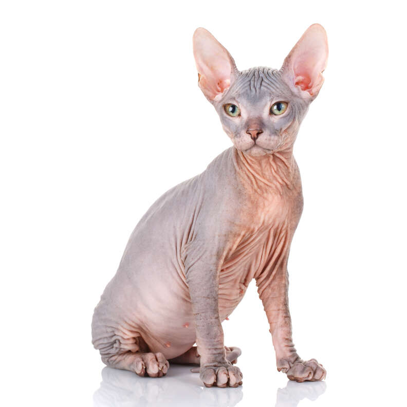
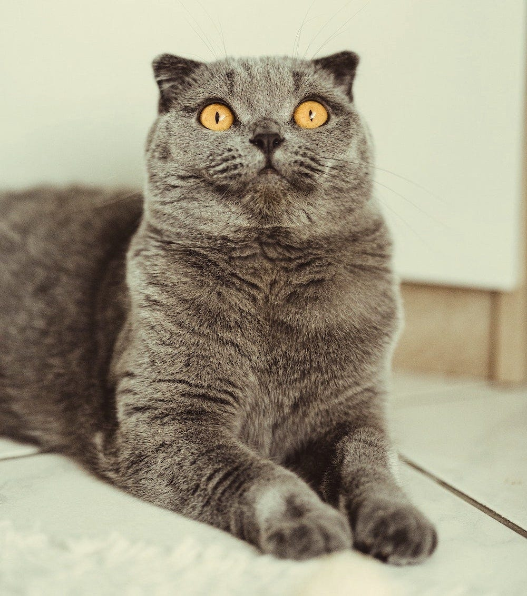

# ResNet-classifies-multiple-types-of-cats
A simple model to classify different cat species using pretrained resnet models.


## Introduction
We used the pre-trained ImageNet ResNet model, changed its fully connected layer, and got 95.90% accuracy on the test set.
## datasets
5 classes of cats。
| Ragdolls | Singapura cats | Persian cats | Sphynx cats | Scottish fold cats |
|----------|----------------|--------------|-------------|--------------------|
|  |  |  |  |  |
## train
Just run the train.py
```py
python train.py
```
Remember to replace data_path with your own path. the default path is './cats'.
## test
Just run the test.py
```py
python train.py
```
Here you need to define test_data, test_labels yourself. You can refer to the method in train.py to read in, or you can read in according to your own method
 
